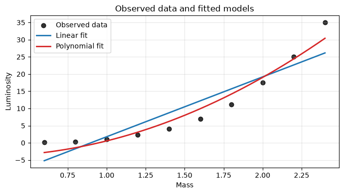
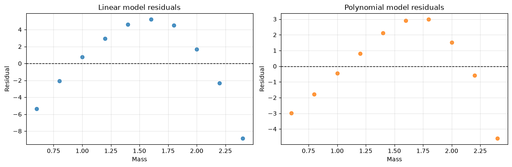

# Stellar Luminosity Analysis

This repository contains a hands-on project to analyze the relationship between stellar mass and luminosity using linear and polynomial regression models.

## Overview

The goal is to explore how stellar parameters correlate with luminosity and compare the performance of simple linear models against more flexible polynomial models.

## Models

- **Linear Model**: Fits a straight line to predict luminosity from one or more stellar features.

- **Polynomial Model**: Extends the linear model by including polynomial terms to capture nonlinear relationships.

## Data

The dataset used in this project is in the stellar luminosity hands-on file, which includes mass for stars and their luminosity values,this is a small instructional dataset inspired by nonlinear main-sequence behavior. It is suitable for studying regression but insufficient for making scientific claims.

## Workflow
1. Establish the environment
2. Exploration of the data
3. Implementation of the learning algorithm
4. Training of a linear model
5. Training of a polynomial model
6. Compare the models
7. Testing of the predictions
8. Reflections

## Results Summary

The following image shows the comparison of both models with the data given, we can see that the fit of the polynomial model it's more accurate, showing how a greater polynomial degree could be a better fit and adjust to the function of the correlation between the properties of stellar luminosity.

We can see that the relationship between mass and the stellar luminosity is non-linear and it's not captured on any of the models done during the project.This can be concluded because the residuals of both models have a clear parabolic shape and are not scattered.

## Usage

This project can be used to:

- Understand how regression models can be applied to astrophysical data.
- Compare linear and nonlinear approaches for stellar luminosity prediction.
- Build intuition for model selection and evaluation.

## Notes

This is a general guide for a hands-on exploration of stellar luminosity correlation using regression. Specific implementation details and results are documented in the project code and analysis notebook.